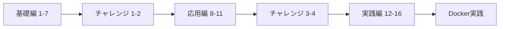

# 🇯🇵 Go 並行・並列・非同期プログラミング学習環境

[](https://go.dev/)
[](LICENSE)
[](https://github.com/kazuhirokondo/go-async-practice/actions)

## 📚 概要

Goの並行処理パターンを実践的に学べる総合学習環境です。基礎から応用まで段階的に習得できます。

### ✨ 特徴

- 🎓 **16種類の並行処理パターン** - 基礎から実践まで
- 🎯 **4つのチャレンジ問題** - 実際のバグを修正して学習
- 📊 **自動評価システム** - コードを即座に採点
- 🐳 **Docker統合** - 実践的なマイクロサービス環境
- 🧪 **包括的なテスト** - Unit/Integration/E2E完備
- 🚀 **ベンチマーク** - パフォーマンス測定

## 🚀 クイックスタート

```bash
# リポジトリをクローン
git clone https://github.com/kazuhirokondo/go-async-practice.git
cd go-async-practice

# 依存関係をインストール
go mod tidy

# メニューを表示
go run cmd/runner/main.go
```

## 📖 学習コンテンツ

### 基礎編（例題1-7）
- **ゴルーチンの基本** - 並行処理の第一歩
- **レース条件** - データ競合の理解と対策
- **チャネルの基本** - 安全な通信方法
- **select文** - 複数チャネルの制御
- **コンテキスト** - キャンセル処理
- **タイムアウト** - 時間制限の実装
- **非ブロッキング操作** - 待たない処理

### 応用編（例題8-11）
- **ワーカープール** - 効率的なタスク処理
- **ファンイン・ファンアウト** - データ分散と集約
- **パイプライン** - 段階的データ処理
- **セマフォ** - 同時実行数制限

### 実践編（例題12-16）
- **サーキットブレーカー** - 障害の伝播防止
- **Pub/Sub** - イベント駆動アーキテクチャ
- **制限付き並列処理** - リソース管理
- **リトライ処理** - エラーハンドリング
- **バッチ処理** - 効率的なデータ処理

## 🎯 チャレンジ問題

実際のバグを修正しながら学習：

1. **デッドロックの修正** - 相互待機の解決
2. **レース条件の修正** - データ競合の防止
3. **ゴルーチンリークの修正** - メモリリーク対策
4. **レート制限の実装** - API制限の実装

## 🏃 実行方法

### 例題の実行
```bash
# 例題1を実行（ゴルーチンの基本）
go run cmd/runner/main.go -mode=example -example=1

# 全ての基礎例題を順番に実行
for i in {1..7}; do
    go run cmd/runner/main.go -mode=example -example=$i
done
```

### チャレンジ問題
```bash
# チャレンジ1に挑戦
go run cmd/runner/main.go -mode=challenge -challenge=1

# 解答例を確認
go run cmd/runner/main.go -mode=solution -challenge=1
```

### 自動評価
```bash
# あなたのコードを評価
go run cmd/runner/main.go -mode=evaluate
```

## 🐳 Docker環境

### 実践的なマイクロサービス環境

```bash
# 環境を起動
make docker-up

# 実践例を実行
make run-practical

# クリーンアップ
make docker-down
```

### 含まれるサービス
- PostgreSQL - リレーショナルDB
- Redis - キャッシュ/Pub-Sub
- RabbitMQ - メッセージキュー
- Kafka - イベントストリーミング
- MinIO - オブジェクトストレージ
- Prometheus - メトリクス収集
- Grafana - 可視化

## 🧪 テスト実行

```bash
# 全テストを実行
./test.sh

# ユニットテスト
go test ./...

# レース条件検出
go test -race ./...

# カバレッジレポート
make test-coverage

# ベンチマーク
go test -bench=. ./benchmarks/
```

## 📊 パフォーマンス比較

```
BenchmarkMutexCounter:        90.55 ns/op
BenchmarkChannelCounter:      105.9 ns/op
BenchmarkAtomicCounter:       33.52 ns/op ← 最速！
BenchmarkBufferedChannel:     46.07 ns/op
BenchmarkUnbufferedChannel:   141.9 ns/op
```

## 🗂 プロジェクト構造

```
go-async-practice/
├── cmd/runner/         # CLIエントリーポイント
├── examples/           # 学習用例題（16パターン）
├── challenges/         # チャレンジ問題
├── solutions/          # 解答例
├── practical/          # 実践的な例（Docker必須）
├── benchmarks/         # パフォーマンス測定
├── internal/evaluator/ # 自動評価システム
├── tests/              # 統合・E2Eテスト
└── docker-compose.yml  # Docker環境設定
```

## 📚 学習の進め方

### 推奨学習パス



### 段階的アプローチ

1. **基礎を固める** - 例題1-7でGoroutineとChannelを理解
2. **問題を解く** - チャレンジ1-2で理解度チェック
3. **パターンを学ぶ** - 例題8-11で応用パターン習得
4. **実践力を養う** - チャレンジ3-4とDocker環境で実装

## 🛠 開発環境

### 必要要件
- Go 1.21以上
- Docker & Docker Compose（実践編用）
- Make（オプション）

### 推奨ツール
```bash
# golangci-lint（コード品質）
go install github.com/golangci/golangci-lint/cmd/golangci-lint@latest

# air（ホットリロード）
go install github.com/cosmtrek/air@latest
```

## 🤝 コントリビューション

プルリクエスト歓迎です！以下の手順でご協力ください：

1. フォーク
2. フィーチャーブランチ作成（`git checkout -b feature/AmazingFeature`）
3. コミット（`git commit -m '素晴らしい機能を追加'`）
4. プッシュ（`git push origin feature/AmazingFeature`）
5. プルリクエスト作成

## 📄 ライセンス

MITライセンス - 詳細は[LICENSE](LICENSE)を参照

## 🙏 謝辞

このプロジェクトは以下のリソースに触発されました：

- [Go Concurrency Patterns](https://go.dev/blog/pipelines)
- [Effective Go](https://go.dev/doc/effective_go)
- Goコミュニティの素晴らしい貢献者たち

## 💬 サポート

質問や問題がある場合は：

- 📝 [Issue](https://github.com/kazuhirokondo/go-async-practice/issues)を作成
- 💡 [Discussions](https://github.com/kazuhirokondo/go-async-practice/discussions)で議論
- 📧 メール: your-email@example.com

---

<div align="center">
  <strong>Happy Learning! 🚀</strong><br>
  Made with ❤️ using Claude Code
</div>